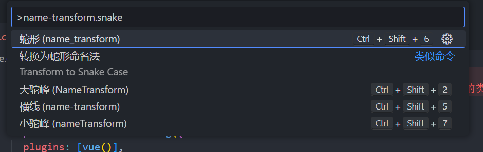
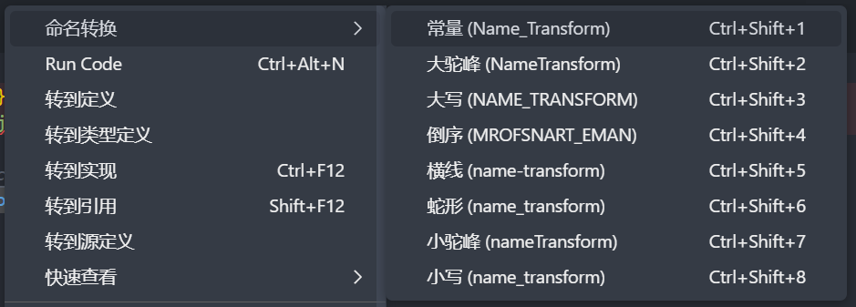

# Name Transform Extension for Visual Studio Code

A wrapper around [name-transform](https://github.com/hanjiangxueying/name-transform) for Visual Studio Code.
Quickly change the case of the current selection or current word.

If only one word is selected, the `name-transform.snake` command gives you a preview of each option:


## Shortcut keys
| win        |                           |
| ---------- | ------------------------- |
| `ctrl+shift+1`   | constant                   |
| `ctrl+shift+2`   | upperCamelCase |
| `ctrl+shift+3`   | uppercase                   |
| `ctrl+shift+4`   | reverse               |
| `ctrl+shift+5`   | kebab |
| `ctrl+shift+6`   | snake   |
| `ctrl+shift+7`   | camelCase   |
| `ctrl+shift+8`   | lowercase                    |

| mac          |                           |
| ------------ | ------------------------- |
| `ctrl+cmd+1`   | constant                    |
| `ctrl+cmd+2`   | upperCamelCase |
| `ctrl+cmd+3`   | uppercase                    |
| `ctrl+cmd+4`   | reverse                    |
| `ctrl+cmd+5`   | kebab |
| `ctrl+cmd+6`   | snake   |
| `ctrl+cmd+7`   | camelCase   |
| `ctrl+cmd+8`   | lowercase                    |

## Right click menu
Select the text right-click pop-up menu item, Realistic name conversion 


## Install

Launch VS Code Quick Open (Ctrl/Cmd+P), paste the following command, and press enter.
```
ext install name-transform
```

## Commands

* `name-transform.camelCase`: Change Case 'camelCase': Convert to a string with the separators denoted by having the next letter capitalised
* `name-transform.constant`: Change Case 'constant': Convert to an upper case, underscore separated string
* `name-transform.kebab`: Change Case 'kebab': Convert to a lower case, dash separated string (alias for param case)
* `name-transform.upperCamelCase`: Change Case 'upperCamelCase': Convert to a string denoted in the same fashion as camelCase, but with the first letter also capitalised
* `name-transform.lowercase`: Change Case 'lowercase': Convert to a string in lower case
* `name-transform.snake`: Change Case 'snake': Convert to a lower case, underscore separated string
* `name-transform.uppercase`: Change Case 'uppercase': Convert to a string in upper case
* `name-transform.reverse`: Change Case 'reverse': Convert to a string reverse order

## Support
[Create an issue](https://github.com/hanjiangxueying/name-transform/issues)


**Enjoy!**